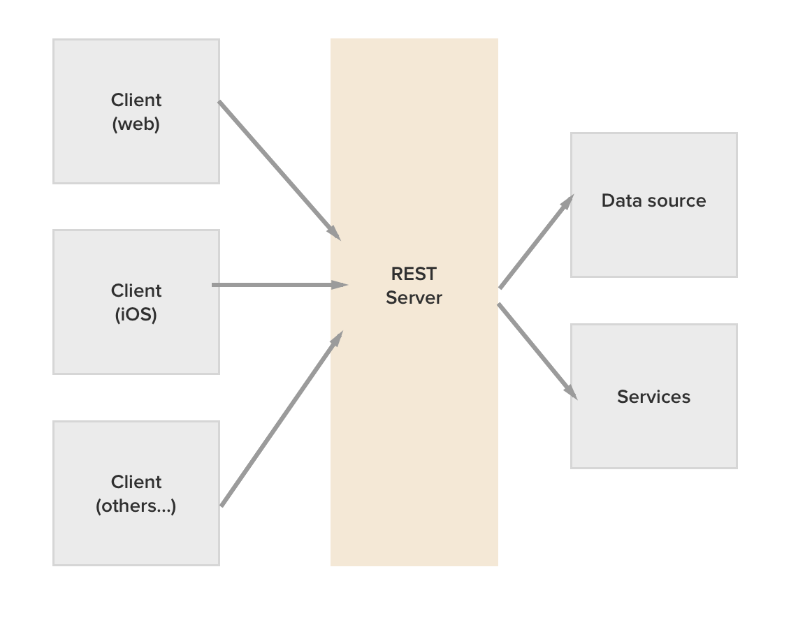
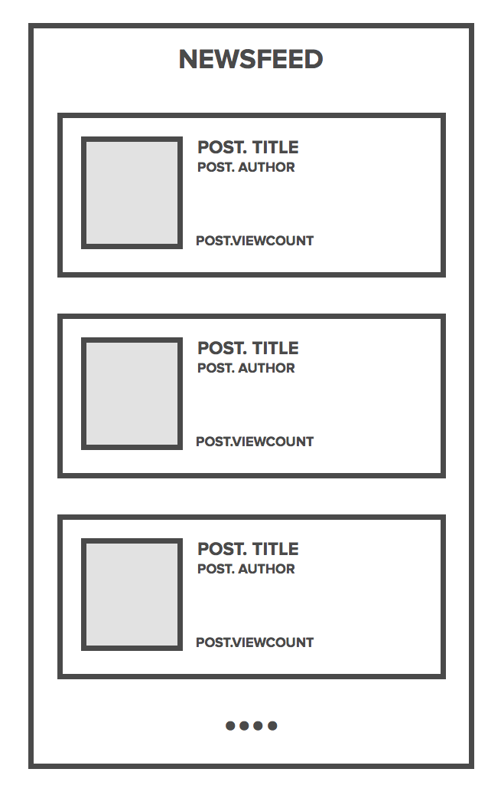
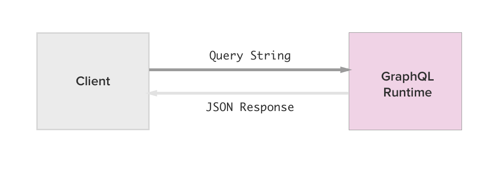
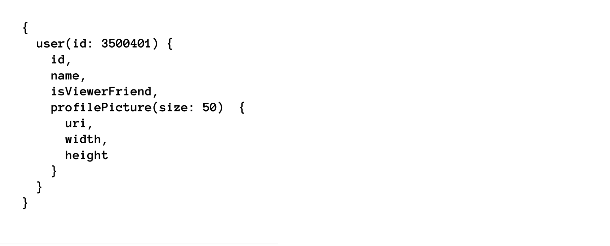
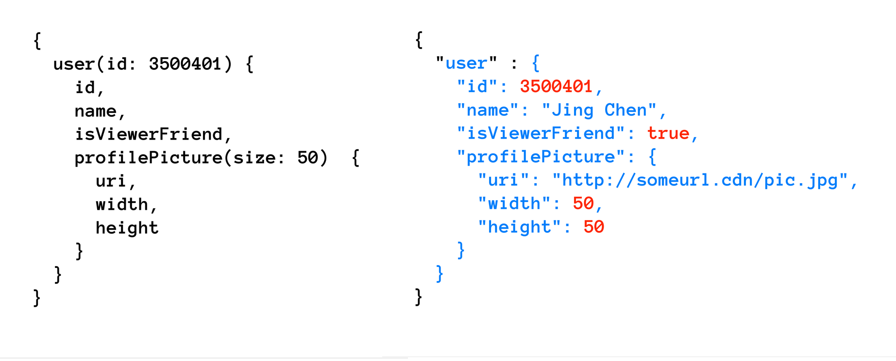
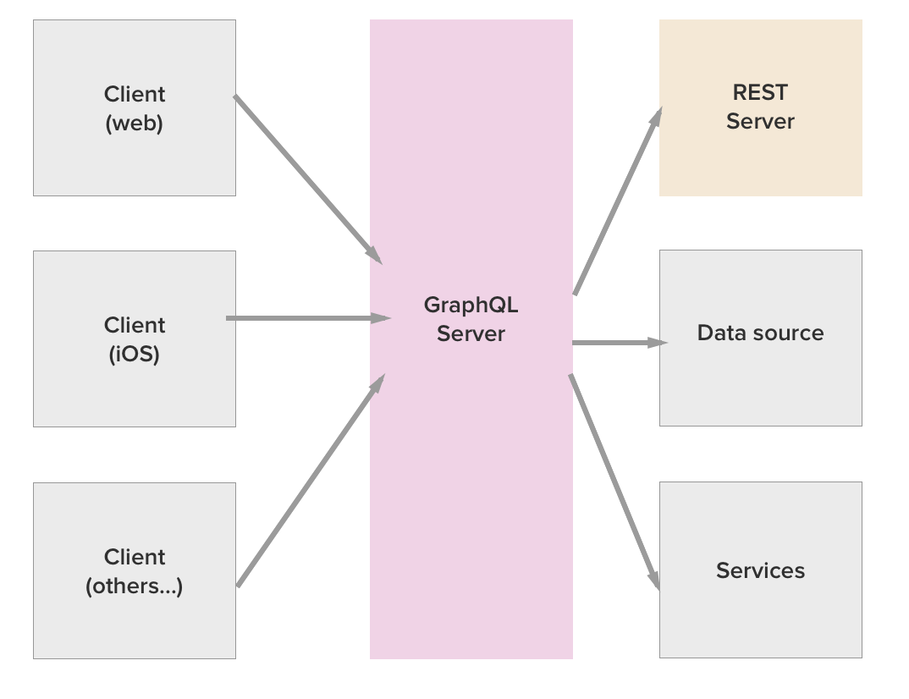
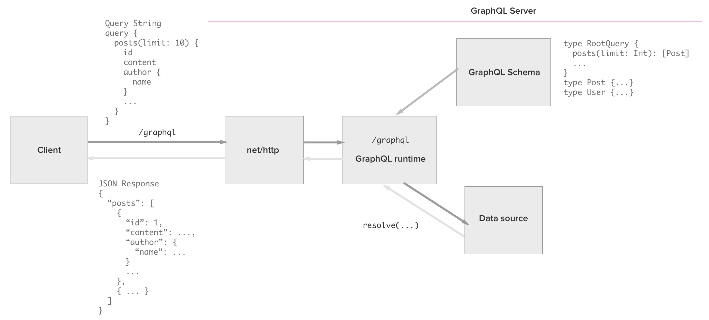

# GraphQL in Go

---

# Who Am I

---

## Hafiz Ismail 
### @sogko on all social media
### Co-maintainer for `graphql-go`
##### https://github.com/graphql-go/graphql

----

# What is this about?

----

# What is this about?
## GraphQL + Go

---

## What is this about?
- GraphQL
	- How GraphQL addresses some common issues faced when building a __REST__-backed application.
- Go
	- Building a GraphQL server in Go. Yay.

---
# Who is this for?
---
## Who is this for?
### Developers, developers, developers


--- 

# Let's start!

---

### Typical architecture of a web application using __REST API__ 
- Multiple rich-clients
- Multiple sources of data / microservices
- API Gateway



---

## Common issues with REST APIs
We'll be looking at two most common issues faced by client and backend developers.

### Issue #1: Multiple round trips
### Issue #2: Over-fetching data


---


## Consider the following: 
### A newsfeed SPA

Two __resources__
- Users
- Posts


----


## Let's say we build it with a REST API

```
POST /posts
GET /posts/1
PUT /posts/1
DELETE /posts/1
...
POST /users
GET /users/1
PUT /users/1
DELETE /users/1
...
```
Someone said: Let's achieve strict REST! We can do this!

---

# Let's see what happen

---


### Render newsfeed
```
GET /posts?limit=10
{
  "posts": [
  	{
  		"id": 1,
  		"title": "Hello world!",
  		"author_id": 10,
  		"likedCount": 3,
  		"likedBy": [1, 3],
  	},
  	...
  ]
}

```
Great! 
Oh wait, we need to get `author's name` and `avatar URL`

---


### Render newsfeed
```
GET /posts?limit=10
GET /users/10
{
  "user": {
		"id": 10,
  		"name": "John Doe",
  		"handle": "Johnny",
  		"age": 23,
  		"avatar_url": "/avatar/10.jpg"
  	}
}


-
```
So we make another request to get the author for the first post...

---


### Render newsfeed
```
GET /posts?limit=10
GET /users/10
GET /users/20
{
  "user": {
		"id": 20,
  		"name": "Emily Sue",
  		"handle": "M",
  		"age": 25,
  		"avatar_url": "/avatar/20.jpg"
  	}
}


-
```
Alright...

---


### Render newsfeed
```
GET /posts?limit=10
GET /users/10
GET /users/20
GET /users/30
{
  "user": {
		"id": 30,
  		"name": "Johnny Blaze",
  		"handle": "humantorch",
  		"age": 23,
  		"avatar_url": "/avatar/30.jpg"
  	}
}

-
```
Wait...

---
### Render newsfeed

- Wait, so we have to do a separate request for each post to get information for its author? (Multiple-round trips)
- And we are getting other fields (for e.g. `age`) even though we don't need it for our view (Overfetching)

<br/>

<sup>Hhnnggghhh 😖</sup>

----
### Common approaches to work around these issues
- Have ```GET /users``` to accept array of ids
	- ```GET /users/?ids=[1,2,3,4]```
- Accept params to specify fields to return
	-  ```GET /users?fields=['id', 'name', ...]&ids=[]```
- Create an additional custom-endpoints
	-  ```GET /newsfeed```.
	-  But it's tightly coupled to your client UI.

	
----

## So how do we proceed from here?

---
## Here's where __GraphQL__ can help

---

# What is GraphQL?

---

# What is GraphQL?

GraphQL is a __data query language__ and __runtime__ designed and used at Facebook to request and deliver data to mobile and web apps since 2012
<sup>Source: http://graphql.org</sup>


---

# What is GraphQL?

_What you need to know_: 
- A GraphQL __query is a string__ interpreted by a server that __returns data in a specified format .__ 
	- (i.e. JSON! WOOOT)



	

---
# What is GraphQL?
  Here is an example query and its response:



---
# What is GraphQL?
  Here is an example query and its response:


  
---

## Where does GraphQL fit in?

---
## Where does GraphQL fit in?


---
## How about GraphQL in Go?


---

# Demo time

---

# Recap of the issues


Issue #1: Multiple round trips.
Issue #2: Overfetching of data.

---


# Demo overview
- Sample microblogging app
- GraphQL server in Go (`graphql-go`)
- REST vs GraphQL queries to render views
- How clients can quickly adapt to rapid requirement changes

---

# End Demo

---

# What's next?

---
# What's next?
If you're interested to learn more about __GraphQL__

- GraphQL : https://graphql.org

- `#graphql`
	- Twitter : https://twitter.com/search?q=graphql
	- Medium : https://medium.com/search?q=graphql

- https://wehavefaces.net <sup>#shamelessplug</sup>
	- A couple of introductory articles (Go + GraphQL)
	- More articles coming soon

----

# What's next?
GraphQL libraries for many platforms available
- `graphql-js` (NodeJS)
- __graphql-go (Go/Golang)__
- `graphql-ruby` (Ruby)
- `graphene` (Python)
- `sangria` (Scala)


---
# The real reason why I'm here
---

### Looking for more contributors!
##`graphql-go`
https://github.com/graphql-go/graphql

- 8 months year old baby
- Still at its infancy, but growing fast
- Very pleasant and chill community; constructive discussion always encouraged.
- Actively looking for more contributors (Currently at 15)

---

### Looking for more contributors!
##`graphql-go`
https://github.com/graphql-go/graphql


Ping me __@sogko__ or __@chris-ramon__

Or better yet, dive right in and just __submit a PR!__ 
<sup>Very much encouraged</sup>

---

# Thanks for listening
### Feel free to come up and say hi

- Slides will be up at:
- https://github.com/sogko/gosg-graphql-go-demo

- Keep in touch __@sogko__ (twitter, github)